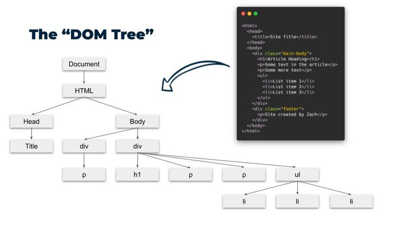

# Aplicaciones Web - Práctica 4: JavaScript Aplicado al Frontend

## El DOM
El Document Object Model (DOM) es una representación de la pagina web. Permite a los lenguajes de programación, como JavaScript, interactuar con la pagina web, permitiendo modificar su estructura, estilo y contenido de manera dinámica.



## Formas de incluir JavaScript en HTML
Existen varias formas de incluir JavaScript en un documento HTML:
1. **Dentro de una etiqueta `<script>`**:
   ```html
   <script>
       // Código JavaScript aquí
       console.log("Hola, mundo!");
   </script>
   ```

2. **Eventos en línea**:
    ```html
    <button onclick="alert('¡Hola!')">Haz clic aquí</button>
    ```

3. **Archivo externo**:
    ```html
    <script src="ruta/al/archivo.js" defer></script>
    ``` 

Normalmente usaremos archivos externos para incluir JavaScript en nuestras páginas web. Ya que de esta forma mantenemos el código HTML y JavaScript separados, lo que facilita el mantenimiento y la legibilidad del código.

**Importante:** Es habitual colocar las etiquetas `<script>` justo antes de la etiqueta de cierre `</body>` para asegurar que el DOM esté completamente cargado antes de que se ejecute el JavaScript. Una opción mejor es usar el atributo `defer` en la etiqueta `<script>`, lo que permite que el navegador descargue el archivo JavaScript mientras sigue procesando el HTML, y ejecuta el script una vez que el DOM esté completamente cargado.


```html
<script src="ruta/al/archivo.js" defer></script>
```


## El objeto document y selectores
El objeto `document` es la forma principal para interactuar con el DOM en JavaScript. 

Los metodos más comunes para seleccionar elementos del documento son los llamados "selectores", los cuales sirven para obtener referencias a los elementos HTML que queremos manipular. Los selectores más importantes son:

- `getElementById(id)`: Selecciona un elemento por su ID.
- `getElementsByClassName(className)`: Selecciona todos los elementos que tienen una clase específica.
- `getElementsByTagName(tagName)`: Selecciona todos los elementos con una etiqueta específica.
- `querySelector(selector)`: Selecciona el primer elemento que coincide con un selector CSS.
- `querySelectorAll(selector)`: Selecciona todos los elementos que coinciden con un selector CSS.

Estos métodos devuelven referencias a los elementos del documento en forma de un objeto `HTMLElement` o una colección de objetos `HTMLElement`, que luego podemos almacenar en variables y manipular utilizando JavaScript.

## HTMLElement
`HTMLElement` es una clase (tipo de objeto) que sirve para representar elemeentos HTML del documento. Todos los elementos HTML son un tipo de `HTMLElement`. 

Algunos atributos y metodos interesantes de `HTMLElement` son:

- `id`: El identificador único del elemento.
- `className`: Las clases CSS del elemento como una cadena de texto.
- `classList`: Una lista de las clases CSS del elemento, que permite agregar, eliminar o alternar clases.
- `style`: Permite acceder y modificar los estilos CSS del elemento.
- `children`: Una colección de los elementos hijos del elemento.
- `parentNode`: El elemento padre del elemento.
- `textContent`: El contenido de texto del elemento.


## Manipulación de elementos del documento
Una vez que hemos seleccionado un elemento del documento, podemos manipular sus atributos y contenido utilizando JavaScript.

Para manipular atributos, podemos usar los métodos `getAttribute`, `setAttribute`, y `removeAttribute`.

- `getAttribute(nombreAtributo)`: Obtiene el valor de un atributo específico.
- `setAttribute(nombreAtributo, valor)`: Establece el valor de un atributo específico.
- `removeAttribute(nombreAtributo)`: Elimina un atributo específico.

Para manipular el contenido de un elemento, podemos usar las propiedades `innerHTML`, `textContent`, y `innerText`.

- `innerHTML`: Permite obtener o establecer el contenido HTML de un elemento.
- `textContent`: Permite obtener o establecer el contenido de texto de un elemento, ignorando las etiquetas HTML.
- `innerText`: Similar a `textContent`, pero tiene en cuenta el estilo CSS y no incluye el texto oculto.
Principalmente usaremos `textContent` para manipular el contenido de texto de los elementos.

Tambien podemos manipular sus estilos y clases utilizando las propiedades `style` y `classList` del elemento. Por ejemplo:

- Para cambiar el estilo de un elemento:
    ```javascript
    const elemento = document.getElementById("miElemento");
    elemento.style.color = "red"; // Cambia el color del texto a rojo
    elemento.style.backgroundColor = "yellow"; // Cambia el color de fondo a amarillo
    ```

- Para agregar, eliminar o alternar clases:
    ```javascript
    const elemento = document.getElementById("miElemento");
    elemento.classList.add("nuevaClase"); // Agrega una clase
    elemento.classList.remove("claseExistente"); // Elimina una clase
    elemento.classList.toggle("otraClase"); // Alterna una clase, es decir, si la tiene la elimina, si no la tiene la agrega
    ```

## Creación y eliminación de elementos
Podemos crear elementos HTML nuevos utilizando el método `createElement` del objeto `document`. Pero esto no agregara el elemento al DOM automáticamente, para eso debemos utilizar el metodo `appendChild`, que agrega un elemento como hijo **último** de otro elemento.

- Para crear y agregar un nuevo elemento:
``` javascript
const nuevoElemento = document.createElement("div");
nuevoElemento.textContent = "¡Hola, mundo!";
document.body.appendChild(nuevoElemento);
```

Tambien podemos eliminar elementos del documento utilizando el metodo `removeChild` del elemento padre.

- Para eliminar un elemento:
``` javascript
const elementoAEliminar = document.getElementById("miElemento");
elementoAEliminar.parentNode.removeChild(elementoAEliminar);
```

## Eventos y Listeners
Los eventos son acciones que el navegador es capaz de detectar, como clics de botones, movimientos del ratón, o envíos de formularios. Los listeners son funciones que se ejecutan en respuesta a estos eventos. Se pueden agregar listeners utilizando el método `addEventListener`. Por ejemplo:

```javascript
const boton = document.getElementById("miBoton"); // Selecciona el botón por su ID

boton.addEventListener("click", miFuncion); // Agrega un listener para el evento 'click'

function miFuncion() {
    alert("¡Botón clickeado!");
}
```

En este ejemplo, cuando el usuario hace clic en el botón con el ID `miBoton`, se ejecuta la función `miFuncion`, que muestra una alerta.

Algunos de los eventos más comunes son:

- `click`: Se activa cuando se hace clic en el elemento.
- `mouseover`: Se activa cuando el puntero del ratón se mueve sobre el elemento.
- `mouseout`: Se activa cuando el puntero del ratón se mueve fuera del elemento.
- `submit`: Se activa cuando se envía un formulario. Solo se aplica a elementos `<form>`.
- `input`: Se activa cuando el valor de un campo de entrada cambia. Solo se aplica a elementos `<input>`, `<textarea>`, y `<select>`.
- `change`: Se activa cuando el valor de un campo de entrada pierde el foco y ha cambiado.
- `focus`: Se activa cuando un elemento recibe el foco.
- `blur`: Se activa cuando un elemento pierde el foco.

## Botones
Los botones en HTML se crean utilizando la etiqueta `<button>`. Los botones pueden tener diferentes tipos, como `submit`, `reset`, y `button`.

- `<button type="button">`: Un botón genérico que no realiza ninguna acción por defecto.
- `<button type="reset">`: Cuando se pone dentro de un formulario, restablece todos los campos del formulario a sus valores iniciales. (Los formularios los veremos mas adelante)
- `<button type="submit">`: Cuando se pone dentro de un formulario, envía los datos del formulario al servidor o a la URL especificada en el atributo `action` del formulario. (Los formularios los veremos mas adelante)

Nota: dentro de un `<form>`, un `<button>` sin atributo `type` se comporta como `type="submit"` por defecto. (Los formularios los veremos mas adelante)

Además, los botones tienen otra serie de atributos importantes como:

- `disabled`: Deshabilita el botón, impidiendo que el usuario pueda interactuar con él.
- `name`: Define el nombre del botón, que se envía junto con los datos del formulario.
- `value`: Define un valor valor del botón, que se envía junto con los datos del formulario.
- `form`: Asocia el botón a un formulario específico mediante el ID del formulario. (Los formularios los veremos mas adelante)

Tener en cuenta que a parte de botones se pueden crear otros elementos interactivos como sliders, checkboxes, radio buttons, etc., utilizando las etiquetas `<input>`, `<select>`, y `<textarea>`. Estos elementos también pueden tener eventos y listeners asociados para manejar la interacción del usuario. 

## Span y Div
Los elementos `<div>` y `<span>` son contenedores genéricos en HTML que se utilizan para agrupar otros elementos y aplicarles estilos o scripts. Por defecto, no tienen funcionalidad especial ni son visibles. Pero esto se puede cambiar mediante CSS y JavaScript. Estos elementos HTML son como "lienzos en blanco" que podemos usar para estructurar y diseñar nuestras páginas web.

La principal diferencia entre `<div>` y `<span>` es su comportamiento de visualización:

- `<div>` es un elemento de bloque (block-level), lo que significa que ocupa todo el ancho disponible y comienza en una nueva línea. Se utiliza para agrupar elementos más grandes o secciones completas de contenido.
- `<span>` es un elemento en línea (inline), lo que significa que solo ocupa el espacio necesario para su contenido y no comienza en una nueva línea. Se utiliza para agrupar partes pequeñas de texto o elementos dentro de una línea.

## Entrega

De forma similar a la práctica anterior, esta práctica consiste en crear un proyecto web básico que incluya HTML, CSS y JavaScript. El objetivo es que practiqueis la manipulación del DOM con JavaScript, que es la forma de introducir JavaScript en el frontend.

Como las cosas que os pido son bastante variadas y pueden no tener mucho sentido juntas, en esta práctica utilizaremos un proyecto nuevo, en lugar de utilizar la práctica anterior. Lo que aprendais podreis aplicarlo en proyectos. Simplemente se trata de practicar.

La estructura del proyecto debe ser la siguiente:
```
css/styles.css
js/app.js
index.html
```

Si incluiis imágenes, videos u otros recursos, deben ir en carpetas separadas dentro de la carpeta principal del proyecto. Estas carpetas se llamarán `images`, `videos`, `audio`, etc.

Para prácticar la manipulación del DOM, debereis implementar las siguientes funcionalidades en vuestra página web:

1. Un botón que, al hacer clic, cambie el texto de un párrafo (`<p>`).
2. Un parrafo que al pasar el ratón por encima cambie el color color de fondo y al quitar el ratón vuelva al color original. Sin utilizar el hover de CSS (aunque es como se debería hacer normalmente).
3. Un botón que añada un nuevo elemento a una lista (`<ul>` o `<ol>`) cada vez que se haga clic en él.
4. Un botón que elimine el último elemento de una lista (`<ul>` o `<ol>`) cada vez que se haga clic en él.
5. Un botón que alterne entre mostrar y ocultar una imagen en la página. Utilizando la propiedad `display` de CSS.
6. Dos botones que aumenten y disminuyan un número mostrado.
7. Un campo de texto `<input type="text">` que, al escribir, actualice el contenido de un encabezado (`<h1>`, `<h2>`, etc.) con el texto introducido.
8. Un campo de texto `<textarea>` y un `<p>` que muestre en tiempo real el número de caracteres introducidos en el área de texto.

Pondme todos los puntos en el `index.html` separado por titulos. Tipo `<h2>Parte 1</h2>`, `<h2>Parte 2</h2>`, etc. para que pueda ver claramente cada punto. En el javascript, poned comentarios indicando a que punto corresponde cada parte del código. Tipo `// Parte 1`, `// Parte 2`, etc.

Respecto a la entrega:
- La carpeta del proyecto debe llamarse `Practica4-<nombre>-<apellido>`.
- Debereis entregarla comprimida en un archivo .zip del mismo nombre.